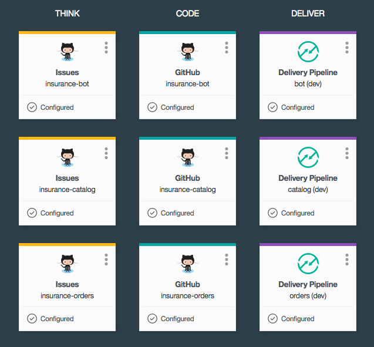

# CloudCo Insurance Toolchain

Get started with this sample, which is an online insurance application that consists of three microservices:  
- [Policy Catalog][github_catalog_url] - An API for retrieving and updating a catalog of insurance policies  
- [Orders][github_orders_url] - An API for retrieving and updating a list of insurance policy orders made by customers  
- [User Interface][github_bot_url] - UI that leverages both of the above APIs to allow users to intelligently query the policies and narrow down to their best possible options. Also includes a bot to interact with the visitor through a chat interface.
- [Dashboard][github_dashboard_url] - A user interface showing an history of the bot chats for further analysis.

## Create the toolchain

1. Ensure you have 3.2GB of free memory and space for 4 additional services in your organization.

1. It is recommended to create a new space in your organization. This helps grouping the apps and services together in the console.

1. **To get started, click this button:**

  

  Clicking it will:
  * **create 4 GitHub repositories** with the required source code for all the application components;
  * **instantiate the toolchain** in your Bluemix org and space;
  * **trigger the toolchain**, thereby deploying the dev and master branches for all application components.

The toolchain is preconfigured for:

- issue tracking
- source control
- continuous delivery and integration (CI/CD)
- unit and code coverage testing
- blue-green deployment

---

### Learn more

* Bluemix DevOps Services: https://new-console.ng.bluemix.net/devops
* Documentation on [Bluemix Toolchains][toolchains_overview_url]
* InterConnect 2016 [video recording][toolchains_interconnect_video_url]
* [IBM Bluemix Garage Method][garage_method_url]

<!--Links-->
[github_bot_url]: https://github.com/IBM-Bluemix/insurance-bot
[github_dashboard_url]: https://github.com/IBM-Bluemix/insurance-bot-dashboard
[github_catalog_url]: https://github.com/IBM-Bluemix/insurance-catalog
[github_orders_url]: https://github.com/IBM-Bluemix/insurance-orders
[toolchains_overview_url]: https://new-console.ng.bluemix.net/docs/toolchains/toolchains_overview.html
[toolchains_interconnect_video_url]: https://vimeo.com/156126035/8b04b8878a
[garage_method_url]: https://www.ibm.com/devops/method
